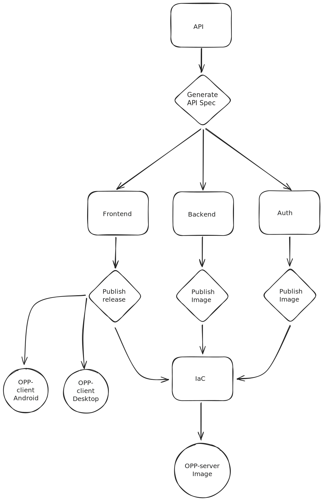

# CICDs

OPP exploits GitHub actions to automate the build and deployment of the OPP application. The following diagram illustrates the process:

Where:

- Squares represent Repositories

- Diamonds represent Actions

- Circles represent outputs

Workflows in a repository triggers others in another repository using Repository Dispatch.