# 🛠️ Admin User Guide

The **Admin Dashboard** empowers system administrators to configure zones, manage user accounts, and maintain smart parking infrastructure.

Admins play a central role in managing roles, zones, totems, and system security.

---

## 👤 Create & Manage User Accounts

Admins can create or manage accounts for:

- ✅ **Controller**
- ✅ **Admin**
#### Admin management:
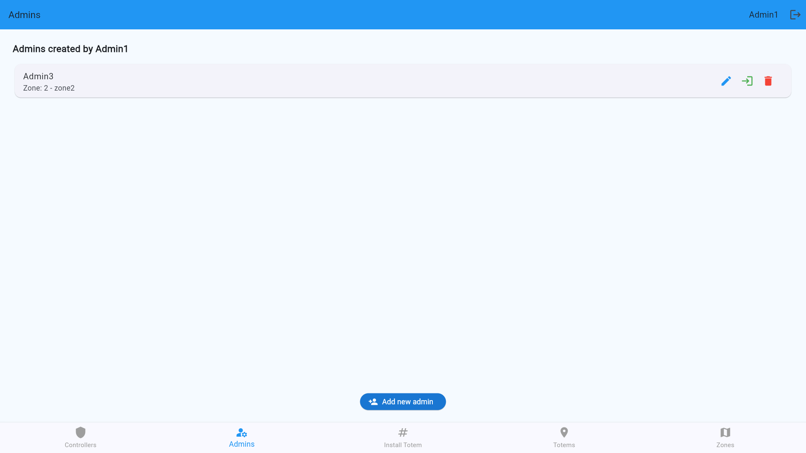
#### Controller management:
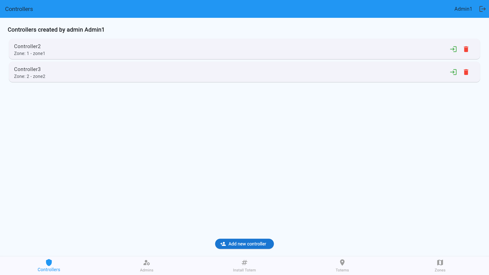

### ➕ Add a New User
1. Press the **Add new user(admin, controller)** button on the below.
2. Fill in the form with the required user information:
3. Select the zone you want to assign the user to (if applicable).
4. Click **Create**
#### Add Admin:
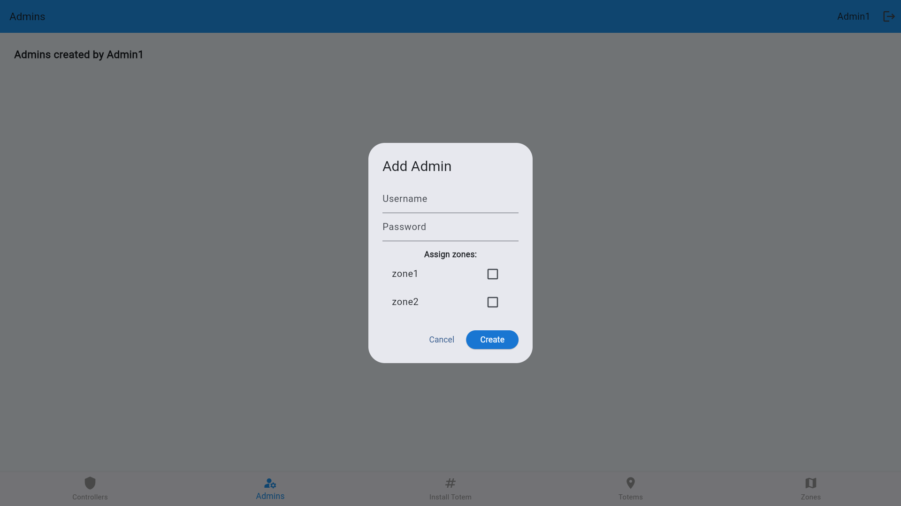
#### Add Controller:
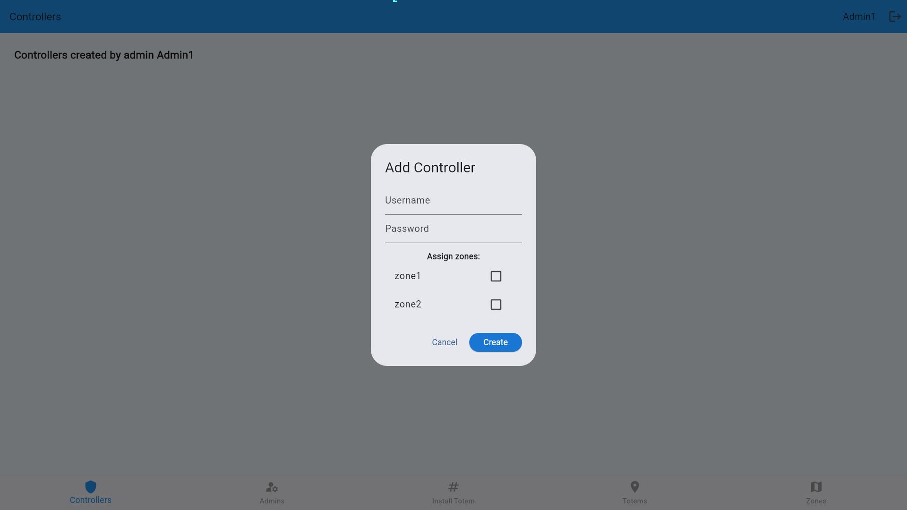
> You must have at least one zone available for assignment, otherwise some functions of the unassigned Controller accounts will be unavailable.
---
### 🗝️ Login a User
Click the **Enter** button on the right side of the specified account (the first button) to log in to the specified account.
### ❌ Delete a User
Click the **Delete** button on the right side of the specified account (the second button) to delete the specified account.

---

## ➕ Create New Parking Zones
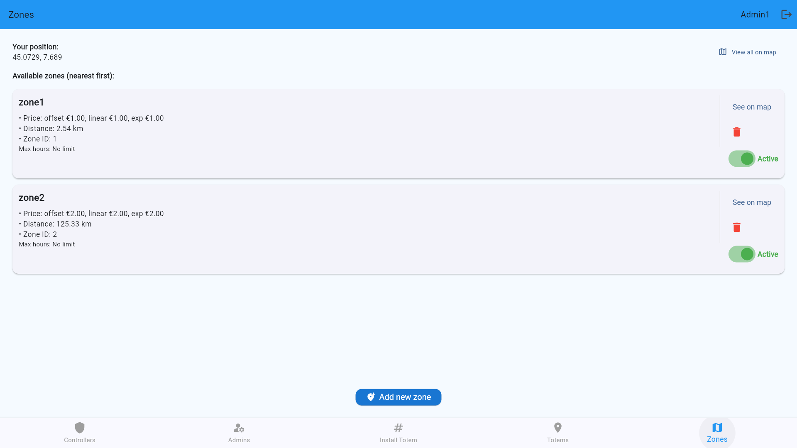
Define zones for precise parking control:
1. Assign **zone name**
2. Fill in **zone pricing configuration**
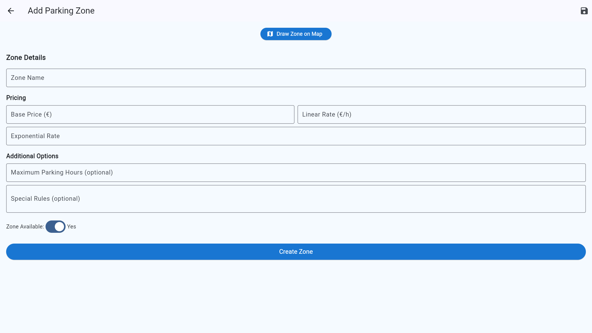
3. Set **location boundaries**
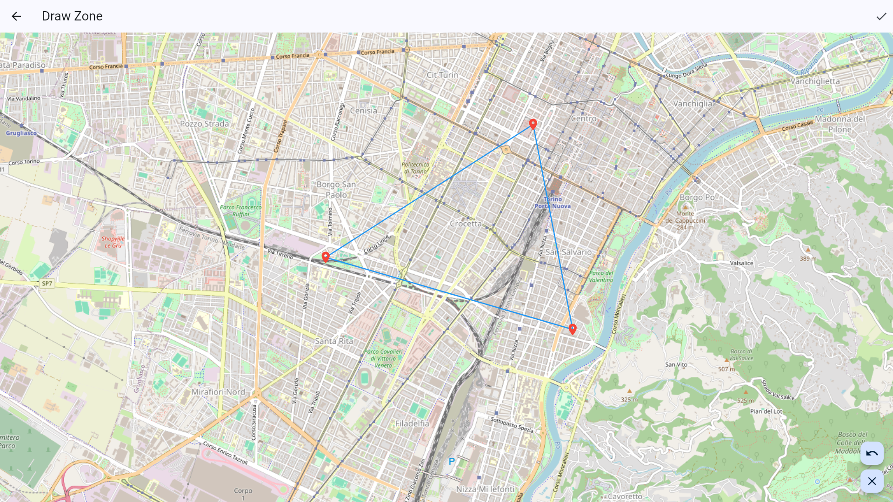
4. Press **Create Zone** to create the zone
> 🗺️ After successful creation, you can view the zone boundaries on the map and set whether the zone is active. Inactive zones will not participate in allocation and cannot be selected by other users or non-users.
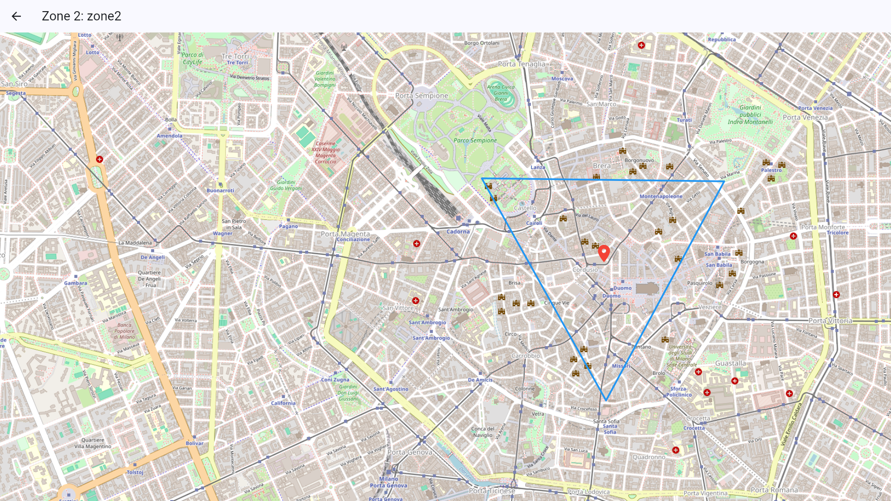
> You can also see all zones on the map by pressing **View all on map**.
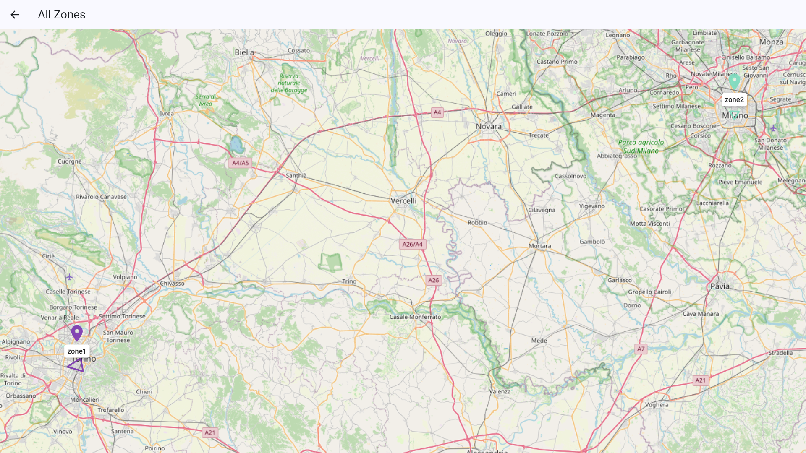

---

## 🏧Generate OTP and Install Totem

🔐Admins can generate time-limited OTP (One-Time Password) tokens for:
- Securely install Totem throughout the application and enable other users or non-users to pay on Totem.

### 🏗️ How to Generate OTP and Install Totem:
1. Press **Generate New OTP** if there is no OTP available.
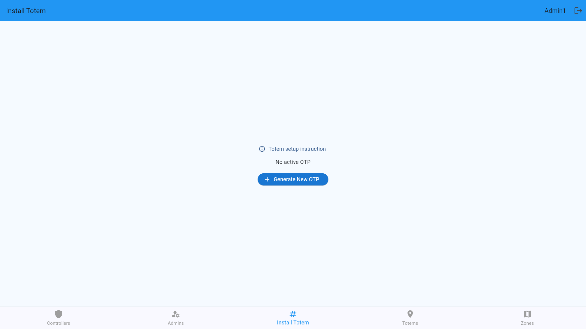
2. Copy the generated OTP code
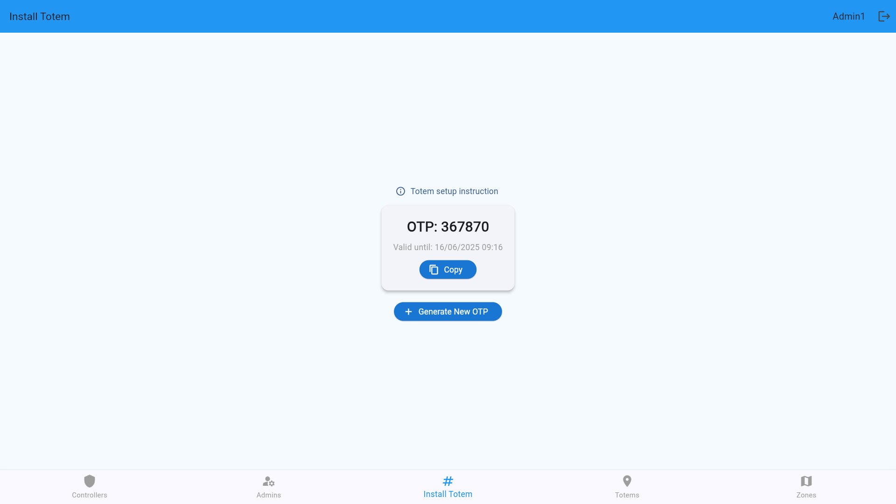
3. Logout and press the **Forgot Password?** on the login page.
4. Enter "0" in the **Email** field to open the OTP install mode.
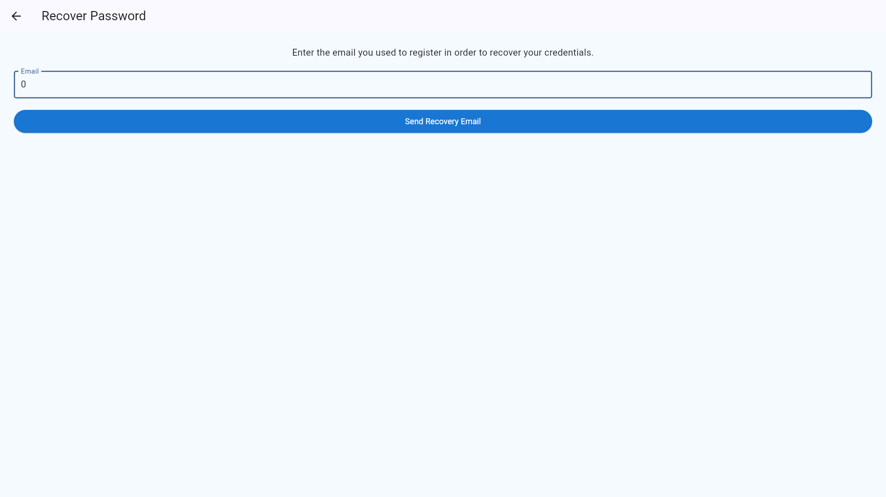
5. Enter the OTP code in the **OTP** field.
6. Press **OK**

7. Select position on the map and zone to install Totem.
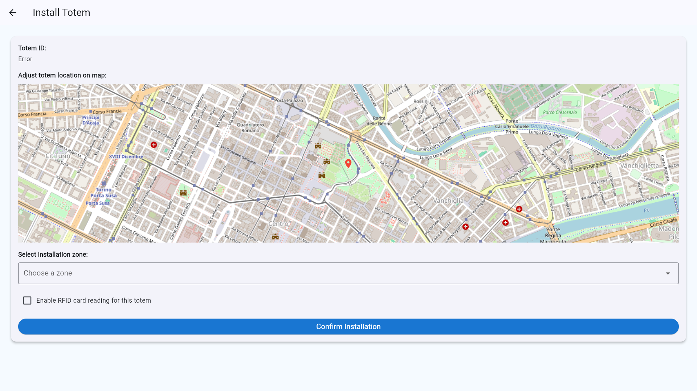
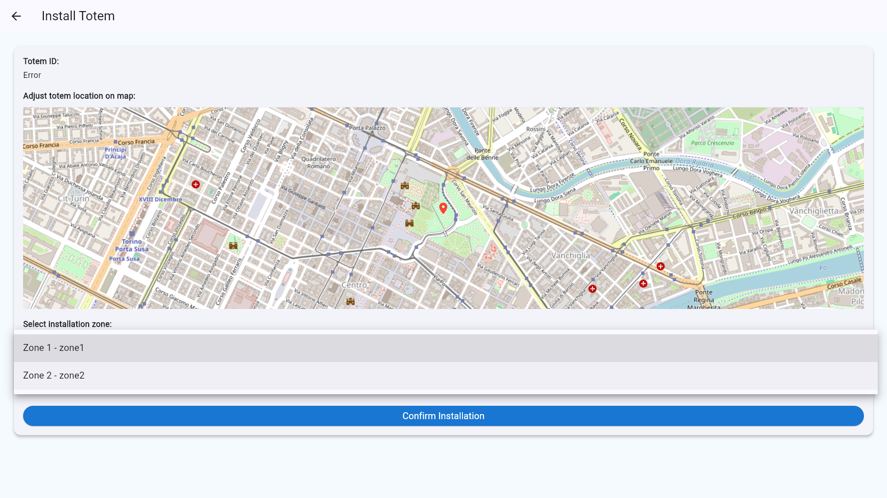
> Enable RFID reader will change the way of payment in the application, so you can enable it if you want to use RFID card to pay on Totem.
#### At this time, the login interface changes, indicating that totem has been successfully installed.

#### Totem can be uninstalled in the OTP install mode. Input "DISABLE" in the **OTP** field and press **OK** to uninstall Totem.
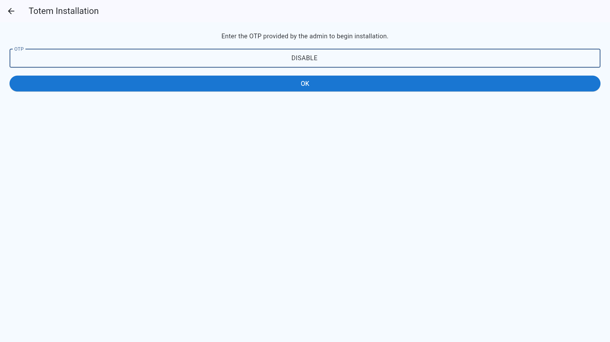
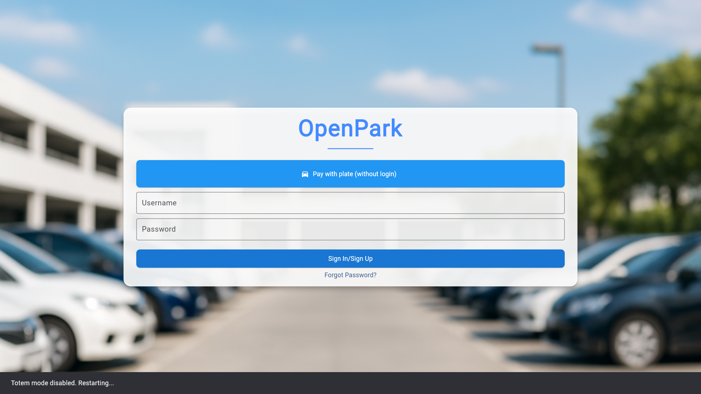
> Totem installed or not will change the way of payment in the application.

---

## 🗺️ View All Totems

- See a **real-time map** of all active Totems
### No totem:
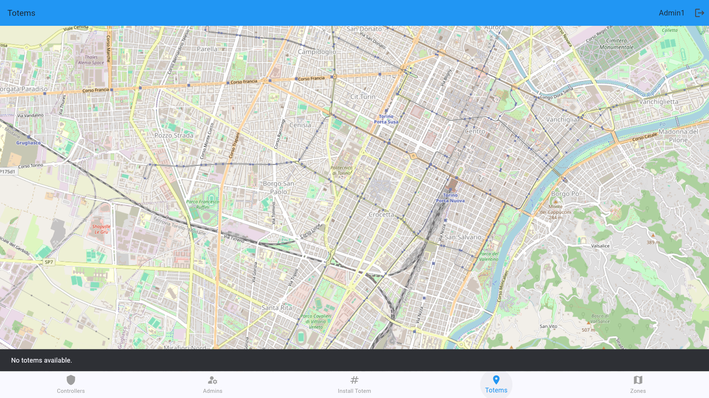
### With totem:
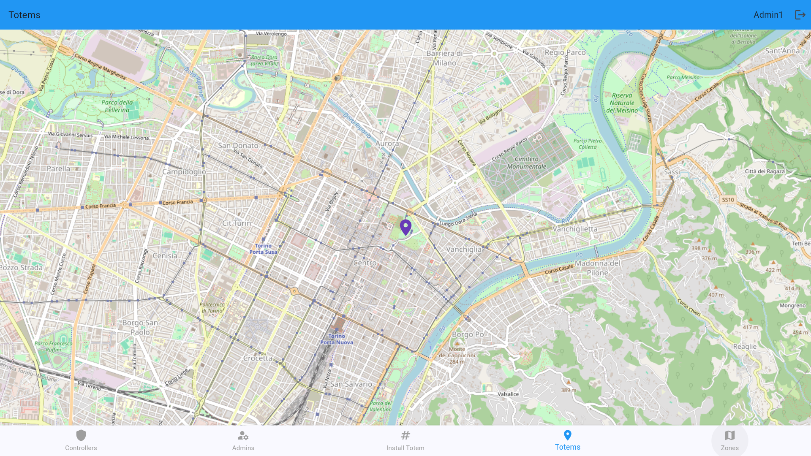

---

