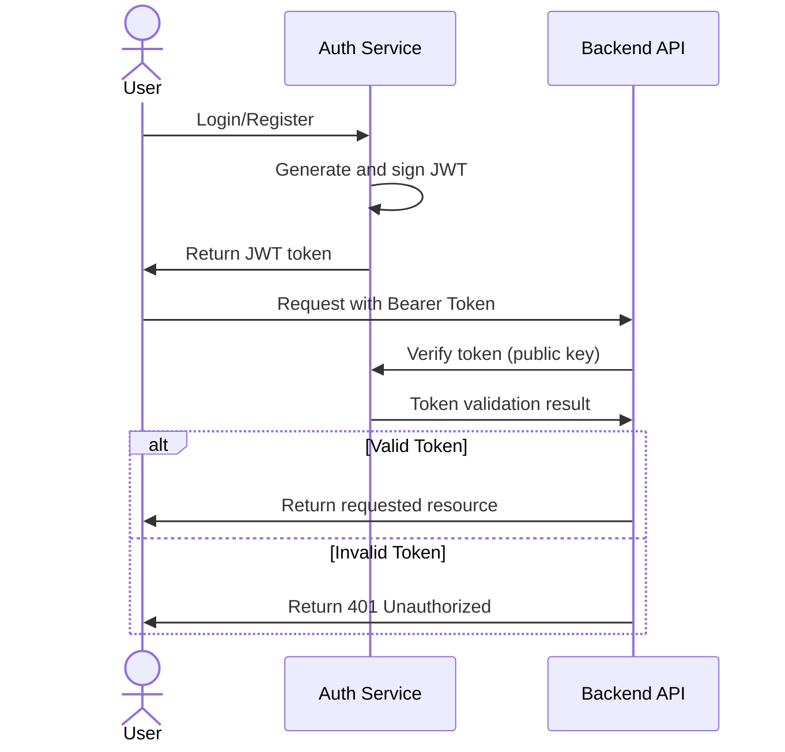

# Authentication
Authentication is done through the `/login` and `/register` endpoints. These endpoints are forwarded to the [auth service](https://github.com/OpenParkProject/OPP-auth) together with the `user` endpoints. The auth service is responsible for generating JWT tokens as well as managing user accounts.

The Auth service creates JWT tokens for the user and returns it to the client. The client stores the JWT token in local storage and sends it with every request to the backend. The backend validates the JWT token using the public key exposed by the auth service at `/pubkey`.

Logout process is not implemented since the expiration time of the JWT is set to a short time and the goal was to have a stateless authentication system. The client can simply remove the JWT token from local storage to log out.
A more advanced solution would be to implemented long-lived refresh token with rotation and invalidation.

## JWT Token Structure
Depending on the user role, the generated JWT token will have different permissions. The following roles are currently supported:
- admin
- controller
- driver
