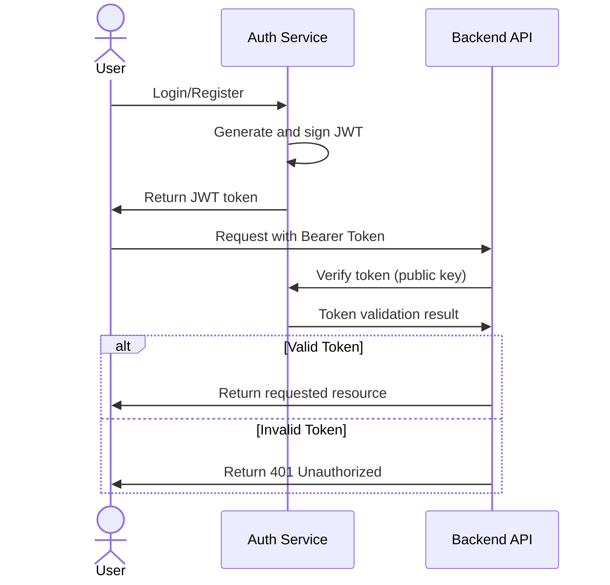

# Authentication
Authentication is done through the `/sessions` endpoints. These endpoints are forwarded to the [auth service](https://github.com/OpenParkProject/OPP-common/openapi.yaml) by the nginx server.

Auth service creates JWT tokens for the user and returns it to the client. The client stores the JWT token in local storage and sends it with every request to the backend. The backend validates the JWT token using the public key exposed by the auth service.

## JWT Token Structure
Depending on the user role, the generated JWT token will have different permissions. The following roles are supported:
- admin
- controller
- driver

WIP