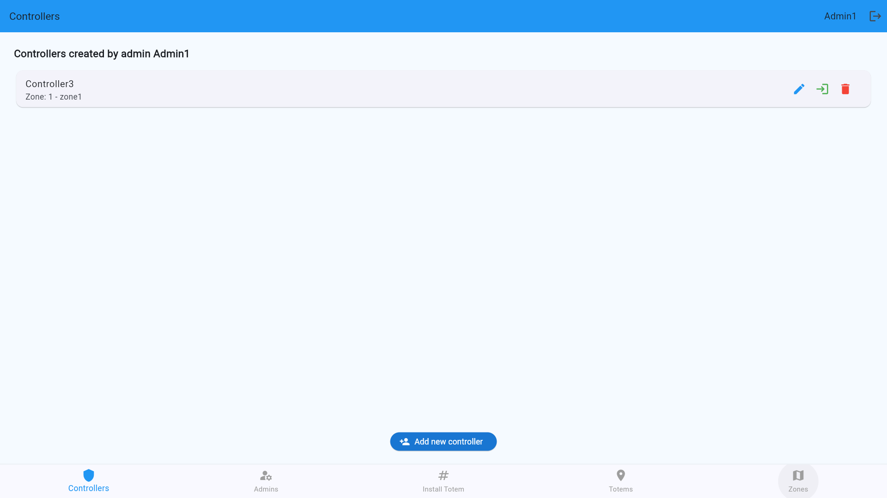
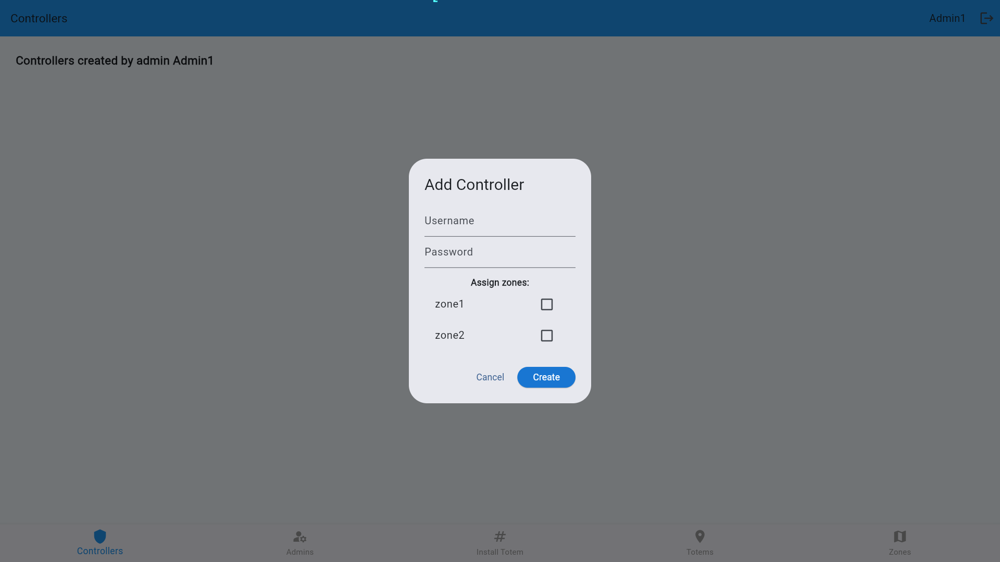
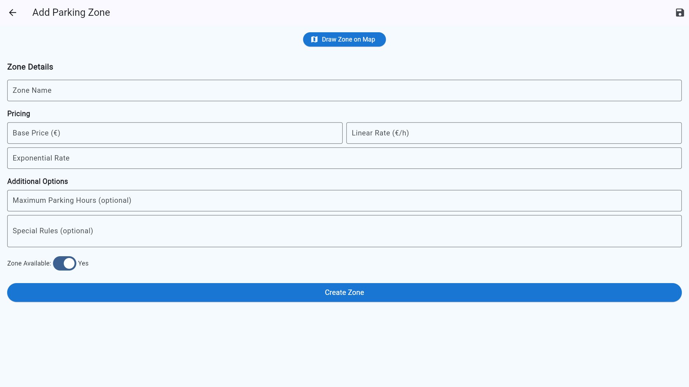
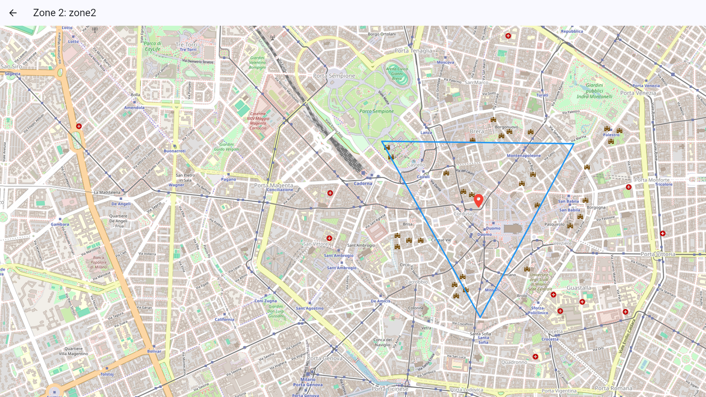

# 🛠️ Admin User Guide

## 🧾 Overview
The **Admin Dashboard** empowers system administrators to configure zones, manage user accounts, and maintain smart parking infrastructure.

Admins play a central role in managing roles, zones, totems, and system security.

An Admin is intended as a user who can manage a group of zones, together with their respective controllers, and is responsible for the management of the parking system in multiple areas.
An example could be a city parking authority or a large parking operator managing multiple locations.
Multiple admins for same zones are allowed.

---

## 👤 Create & Manage User Accounts

Admins can create or manage accounts for:

- ✅ **Controller**
- ✅ **Admin**

However, they can associate those account only to the zones they manage.

#### Admin management:

#### Controller management:

### ➕ Add a New User
1. Press the **Add new user(admin, controller)** button on the below.
2. Fill in the form with the required user information:
3. Select the zone you want to assign the user to (if applicable).
4. Click **Create**
#### Add Admin:

#### Add Controller:

> You must have at least one zone available for assignment, otherwise some functions of the unassigned Controller accounts will be unavailable.
---
### ✏️Edit a User
Click the **Edit** button on the right side of the specified account (the first button) to edit the specified account to assign a new zone.
### 🗝️ Login a User
Click the **Enter** button on the right side of the specified account (the second button) to log in to the specified account.
### ❌ Delete a User
Click the **Delete** button on the right side of the specified account (the third button) to delete the specified account.

#### Edit Admin:

#### Edit Controller:

---

## ➕ Create New Parking Zones

Define zones for precise parking control:
1. Assign **zone name**
2. Fill in **zone pricing configuration**

3. Set **location boundaries**

4. Press **Create Zone** to create the zone
> 🗺️ After successful creation, you can view the zone boundaries on the map and set whether the zone is active. Inactive zones will not participate in allocation and cannot be selected by other users or non-users.

> You can also see all zones on the map by pressing **View all on map**.

---

## 🏧Generate OTP and Install Totem and View Totems

Press **Totem setup instructions** to view the guide.

> See the [Totem Guide](totem.md) for detailed instructions.

