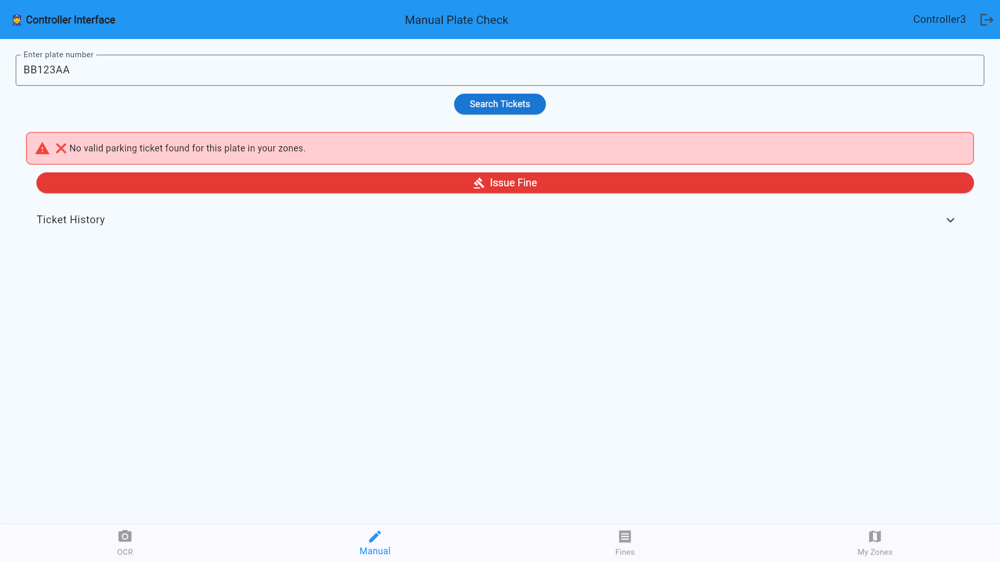
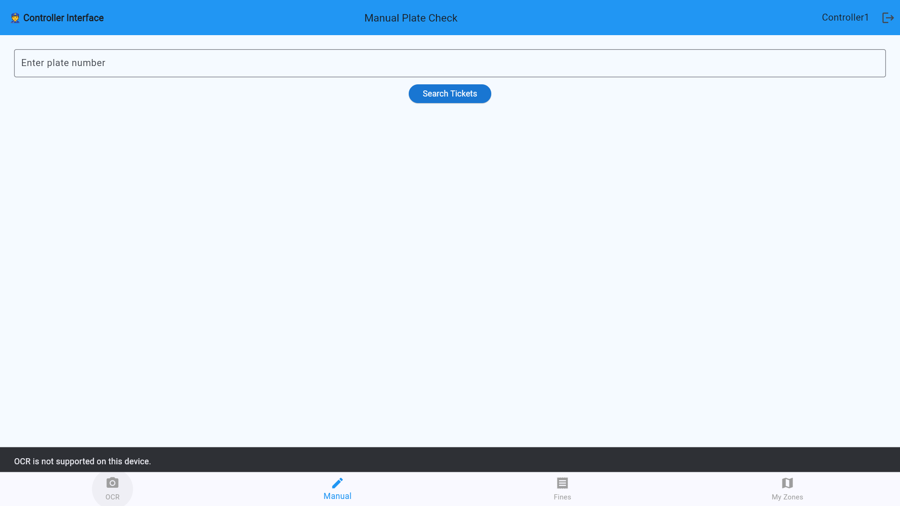
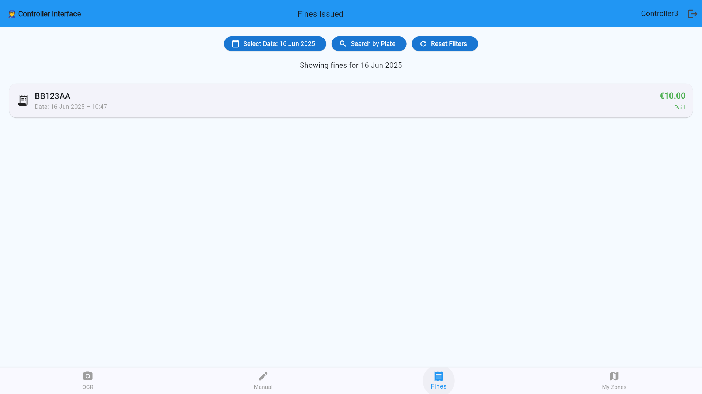

# 🛂 Controller User Guide
## 🧾 Overview
The **Controller Dashboard** is built for enforcement personnel to manage parking violations, inspect vehicle sessions, and oversee their assigned zones.

Controllers are essential for maintaining compliance and order in public parking areas.

Controllers are intended as users who enforce parking rules in one or multiple zones, ensuring that vehicles are parked legally and issuing fines when necessary. They play a crucial role in the day-to-day operations of the parking system.
An example could be a police officer or a private parking company controller.

---

## 🗺️ View Assigned Zones

Each controller is assigned to one zone. From  **My Zones**, you can:

- See a map of your **assigned zone**
- View zone name and ID

---

## 🔍 View License Plate Information and Status

Controllers can search and view detailed data about any vehicle:

1. Input or scan a **license plate number**
>The OCR pointing at images of plates. It is programmed to analyse in a smart way and recognize from the whole text it reads only the one that is in the format of a plate (2 letters, 3 numbers, 2 letters).

> OCR only available on mobile phone.

2. Check if the vehicle is parked legally
> If a violation is confirmed, you can issue a **fine** directly:

---

## 🧾 Add a Fine
1. Press the **Issue Fine** button after confirming a violation
2. Set zone and fine amount (or use preset)

3. Press the **Confirm Fine** button to finalize

---

## 💳 View Fine Status

Controllers can monitor the status of previously issued fines:

