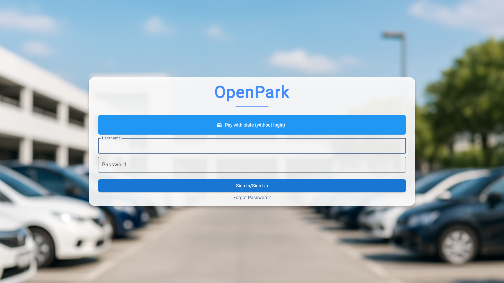
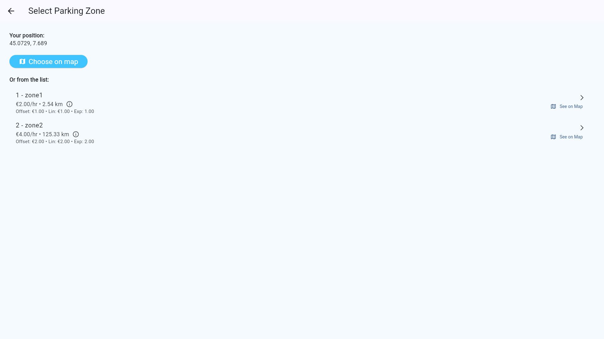
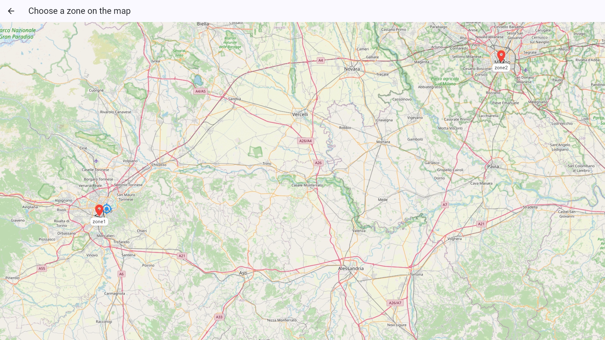
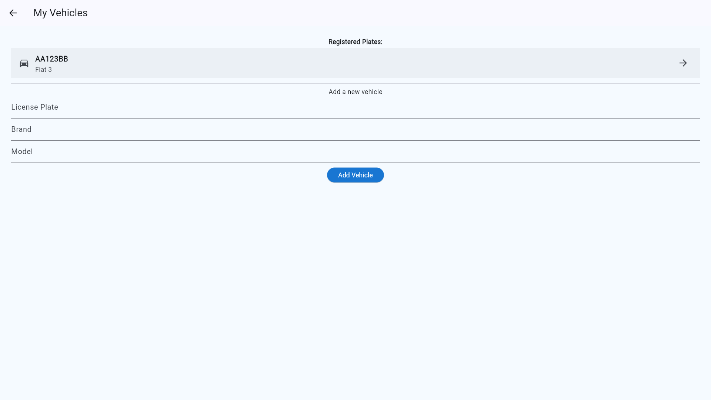
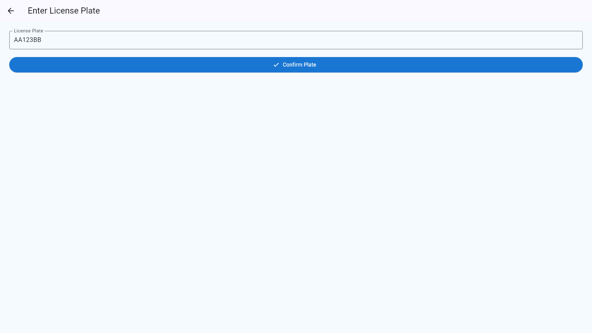

# 💳 Digital Payment Guide
## 🧾 Overview
The **Digital Payment** method allows users to purchase parking tickets directly through the app using secure, online payment options. It supports fast, flexible, and real-time ticket issuance for both registered and non-registered users.

---

## 👤 Payment Process Overview

### 👣 Payment Steps for Registered Users:

1. Press the **Pay with plate(without login)** button
   
2. Select the **zone**
   
> You can also select a zone from the map by pressing the **Choose on map** button.

3. Enter your **license plate** or choose an existing one
   
4. Select the **Parking Duration**:
   
   
   
5. Check out and choose a **payment method**:
 
 - 💳 Credit/Debit Card
  
 - 📱 Apple Pay / Google Pay / Satispay 
6. Ticket is instantly activated
> 💡 Registered users can view ticket history, extend active sessions, and receive expiration notifications.

---

### 👣 Payment Steps for non-registered Users:

1. Press **Pay with plate(without login)**
   
2. Select the **zone**
3. Enter your **license plate**
   
4. Select the **Parking Duration**:
5. Check out and choose a **payment method**:
6. Ticket is instantly activated
