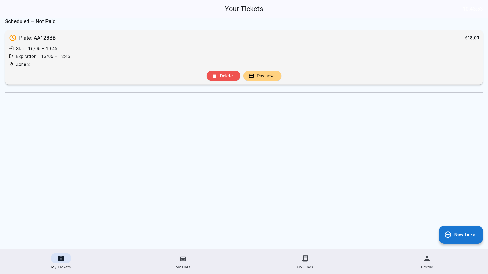
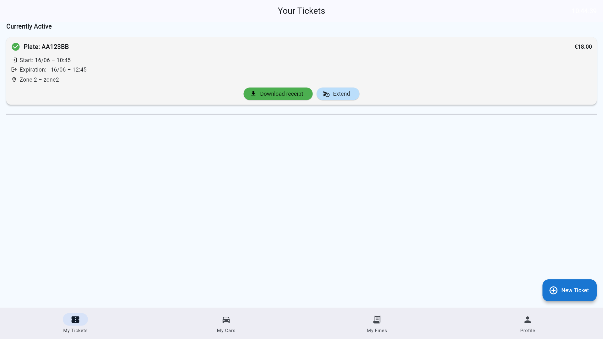
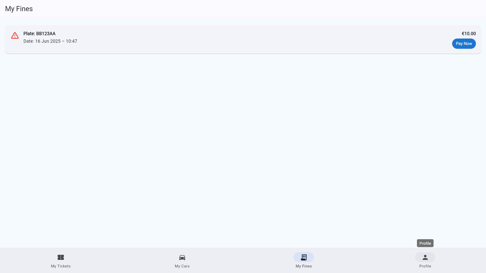
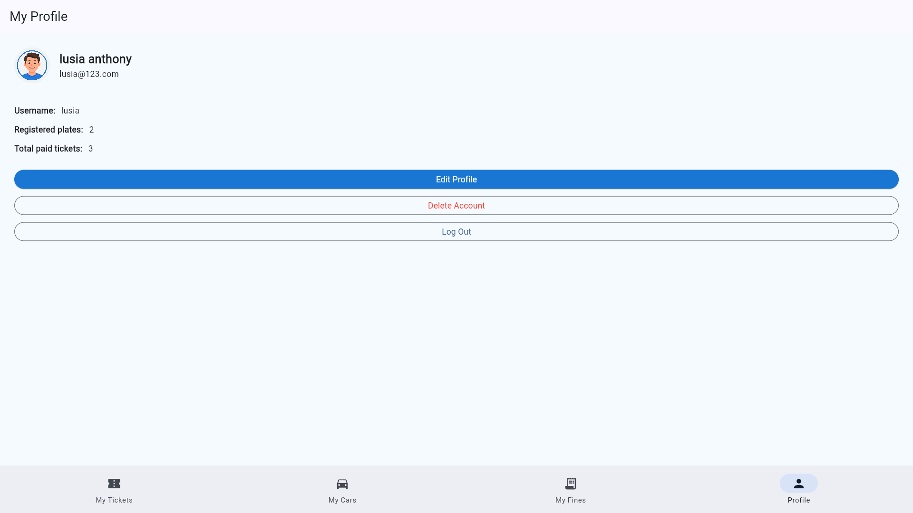
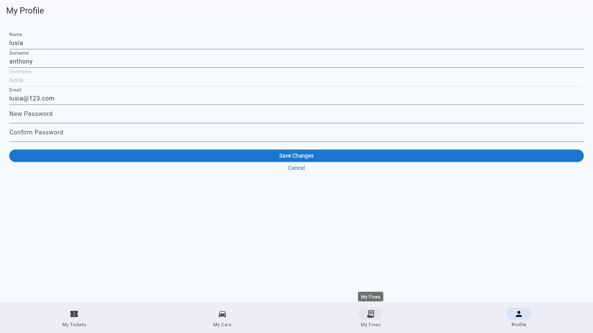

# 🚘 Driver User Guide
## Overview
The **Driver Dashboard** is designed for vehicle owners to manage their parking sessions, purchase tickets, and handle fines. This guide covers all essential features available to drivers.

---

## Register a Driver Account
1. On the login page, input your username and password, then press the **Sign in/Sign up** button.
   
2. If the account does not exist, you will turn to the registration form.
3. Fill in the required fields.
4. Press **Create Account**.

> ✅ Once registered, you can immediately log in.

---

## 🚗 Vehicle License Plate Management

Maintain accurate and updated vehicle info to ensure smooth parking and enforcement checks.

### ✅ Features:
- Add new license plates
- Edit or delete existing plates
- Set a **default plate** for faster ticket purchases

---

## 🎟️ Purchase & Extend Parking Tickets

### 💻 Option 1: Digital Payment via App
See the [Digital Payment Guide](digital_payment.md) for detailed instructions.

### 🏧 Option 2: Pay via Totem (Card Tap): Only available for parking zones with Totem installed.
See the [Totem Guide](totem.md) for detailed instructions.

### 💡 Important Notes:
> You can choose to pay now or later, but the ticket must be paid before the parking session starts.

### 🔄 Extend Active Ticket:
1. Press **Extend Ticket** on an active ticket
2. Add more time to your current session
   
3. Confirm and pay additional amount

> ⏳ You can extend tickets as long as they are active and not expired.
---

## 💳 View & Pay Fines

Drivers can view fines issued by controllers and pay directly through the app.

### 📋 Fine Details:
- Price of fine
- Date & plate number
- Status: `Unpaid`, `Paid`

### 💰 Pay Fines:
1. Select an unpaid fine and press the **Pay Now** button
   
2. Choose payment method
3. View receipt after payment

---

## 👤 Update Personal Information

Keep your profile current and secure.

### 🛠 How to Update:
1. Press the **Edit Profile** button

2. Update your information.

3. Press the **Save Changes** button to apply updates

> You can also delete your account by pressing the **Delete Account** if you no longer need it.
