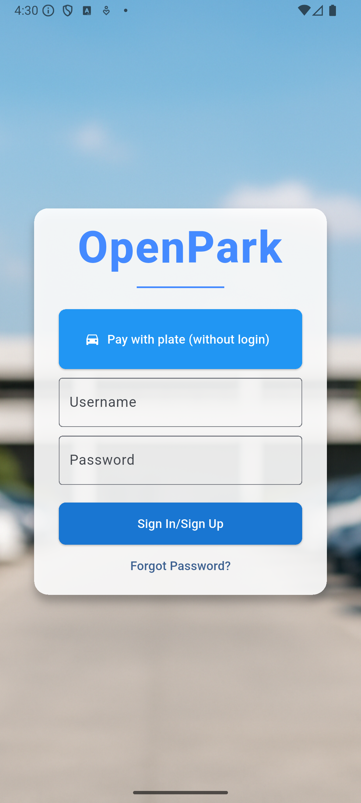
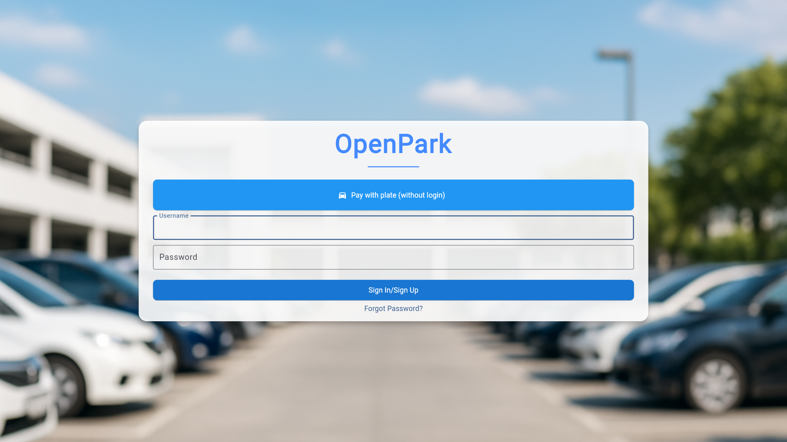

# Open Park Client App
## Overview
The **Open Park** app delivers a comprehensive set of features designed to enhance the parking experience for all user roles — **Drivers**, **Controllers**, **Administrators** and **Superusers**.

---

## Cross-Platform Accessibility

The OpenPark app is available on **Android**, **Desktop**, and **Web** platforms.

> ⚠️ **Note:** Some advanced features may be limited or unavailable on the web version.

### 📱 Mobile Interface (Android Example)

---

### 💻 Web Interface (Edge Example)

---

## Role-Based Functionality

The application provides tailored interfaces and tools for each role:

- 🚘 **[Drivers](driver.md):**  
  Purchase tickets, manage parking sessions, and pay fines.

- 🛂 **[Controllers](controller.md):** 
  Enforce parking rules, issue fines in assigned zones, and monitor vehicle compliance.

- 🛠️ **[Admins](admin.md):**
  Configure zones, manage user accounts, and set up totems for secure payments.

- 🛡️ **[Superusers](superuser.md):**
  Provide global oversight, manage all user roles, view all zones, and access system statistics.

- ✈️ **[Guests](guest.md):**
  Purchase tickets without registration, only by entering license plates.
