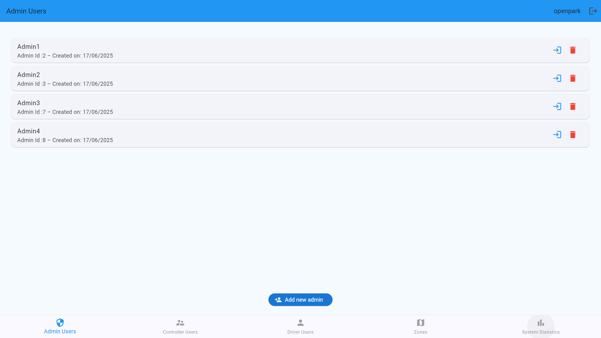
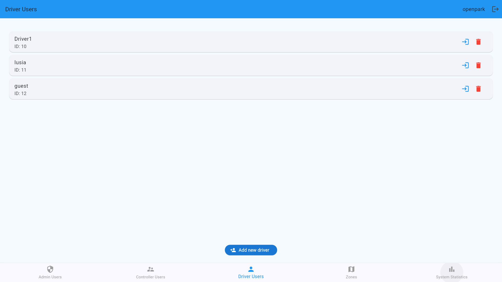
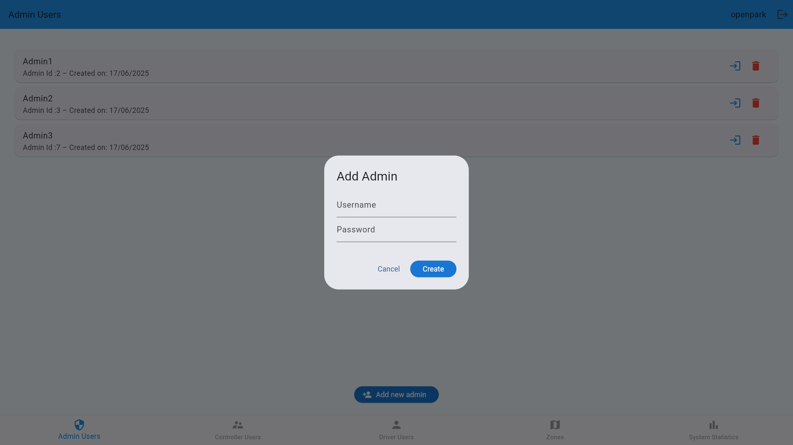
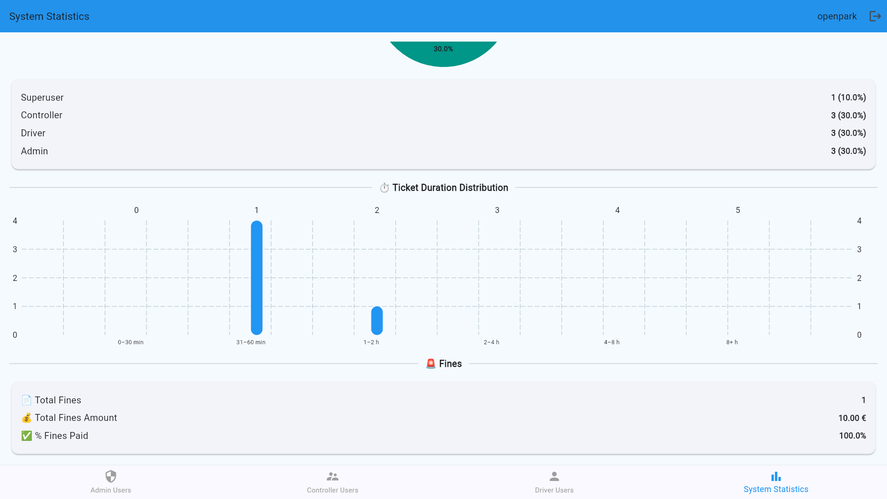

# 🛡️ Superuser User Guide

---

## 🧾 Overview

As a **Superuser**, you have the highest level of control in the Smart Parking system. Your privileges include:

- 🔐 Creating, editing and deleting **any user account** or user data.
- 📊 Viewing complete **system statistics** and analytics

> ⚠️ Superusers accounts are intended for OpenPark system administrators and should not be used for regular parking operations. They have full access to all system features and data.

---

## 👥 User Account Management
Superuser can create or manage accounts for:
- ✅ **Admin**
- ✅ **Controller**
- ✅ **Driver**
#### Admin management:

#### Controller management:

#### Driver management:

> Non-registered user can also be seen and the temporary account has a label "guest" in the user list.

### ➕ Add a New User
1. Press the **Add new user(admin, controller, driver)** button on the below.
2. Fill in the form with the required user information:
3. Click **Create**
#### Add Admin:

#### Add Controller:

#### Add Driver:

> When adding a driver user, some inputs need to meet certain formats, for example, the email address needs to meet the standard email address format.
---
### 🗝️ Login a User
Click the **Enter** button on the right side of the specified account (the first button) to log in to the specified account. 
### ❌ Delete a User
Click the **Delete** button on the right side of the specified account (the second button) to delete the specified account.

---
## 🗺️ View all Parking Zones
Superusers can view all parking zones created on the map. Superusers can also add new zones, edit existing ones, or delete zones that are no longer needed, however, this is typically done by admins, and for this reasons the superuser interface does not include these options.

Superusers can also edit and view the details of each zone, including its name, id, and status (active or inactive).

---
## 📊 System Statistics Dashboard

Superusers can access a global dashboard displaying real-time system metrics, including:

- Total number of:
    - Users
    - Tickets
    - Revenue
    - Average tickets per user
    - Average ticket price
- User roles breakdown:
    - Admins
    - Controllers
    - Drivers
- Ticket duration statistics:
- Fine statistics:
    - Total fines issued
    - Totals fine amount
    - Fines paid

