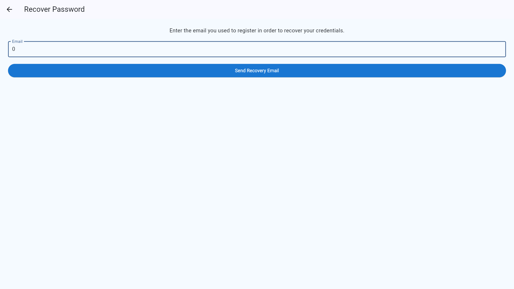
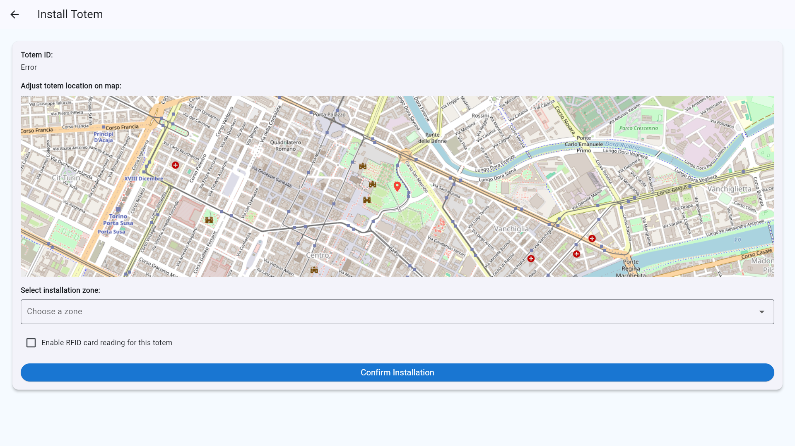
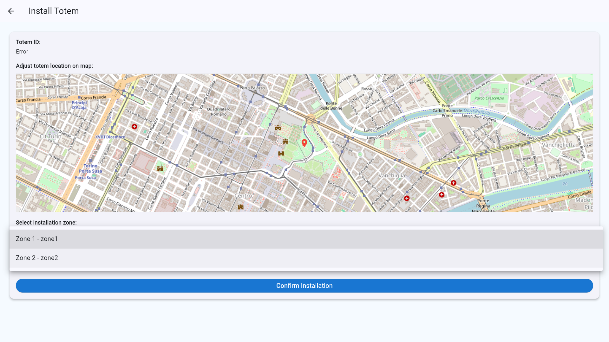
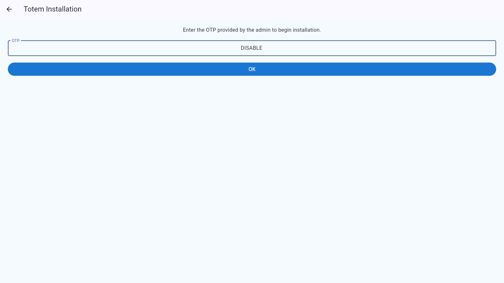
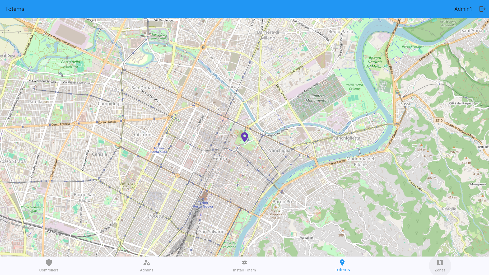

# 🏪 Totem Guide
## 🧾 Overview
The **Totem** is a self-service, automated parking ticket vending machine designed to offer users a fast, intuitive, and app-free ticketing experience in designated parking zones.
Totems are especially helpful for visitors and non-registered users who prefer not to use mobile apps for parking.

The Totem provides a **contactless, account-free** alternative for purchasing tickets.

A **Totem** is a smart, touch-enabled kiosk or terminal installed in parking zones. It connects directly to the parking management system and allows users to:

- Purchase parking tickets
- Make payments via **contactless cards**
- Interact with the system without needing an app or account

Totems are ideal for guest users and tourists and support inclusive access for non-digital users.

---

## ⚙️ Totem Configuration (Admin Setup)

🔐Admins can generate time-limited OTP (One-Time Password) tokens to securely install Totem throughout the application and enable users or guests to pay on it without the need to access the application.

---
### 🏗️ How to Generate OTP and Install Totem:
1. Press **Generate New OTP** if there is no OTP available.
   
2. Copy the generated OTP code
   
3. Logout and press the **Forgot Password?** on the login page.
4. Enter "0" in the **Email** field to open the OTP install mode.
   
5. Enter the OTP code in the **OTP** field.
6. Press **OK**
   
7. Select position on the map and zone to install Totem.
   
   
> Enable RFID reader will change the way of payment in the application, so you can enable it if you want to use RFID card to pay on Totem.
#### At this time, the login interface changes, indicating that totem has been successfully installed.

#### Totem can be uninstalled in the OTP install mode. Input "DISABLE" in the **OTP** field and press **OK** to uninstall Totem.

### 🗺️ Admin can view all Totems
**Real-time map** of all active Totems:

---

## 🛠️ Using the Totem (User Guide)

The usage of the totem is almost entirely the same as [app usage](digital_payment.md), with the difference that that the zone is selected automatically based on the Totem's location. RFID contactless cards can be used for payment if the RFID reader is enabled.