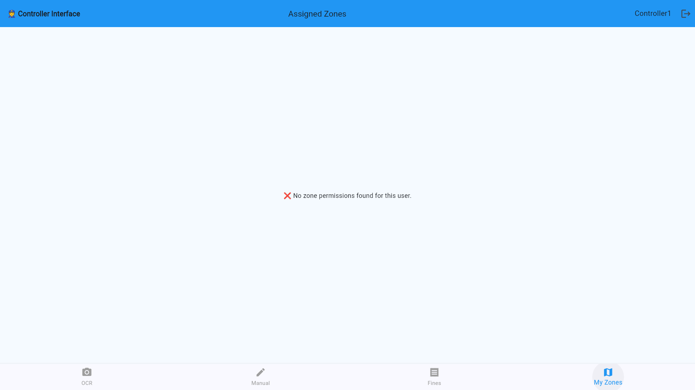
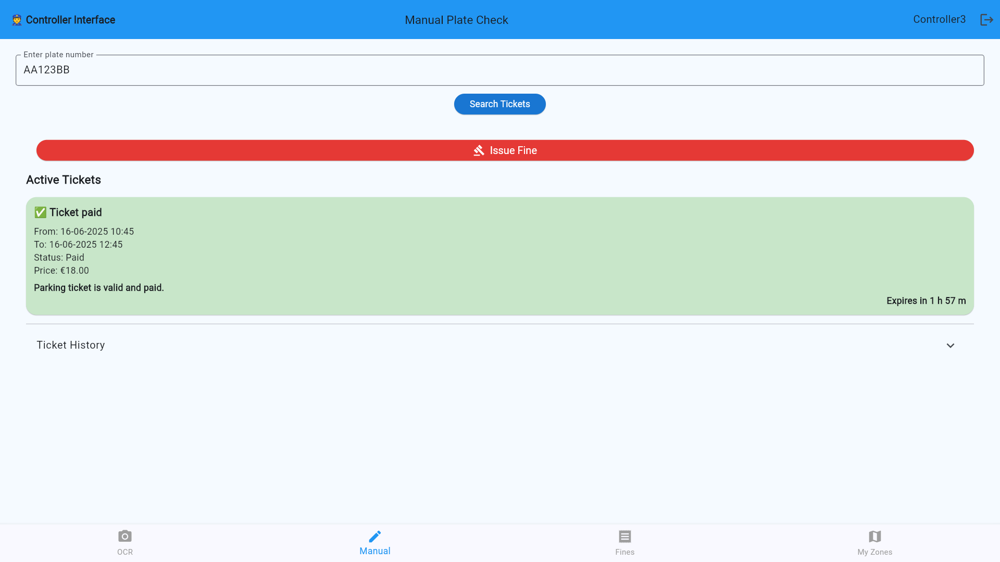
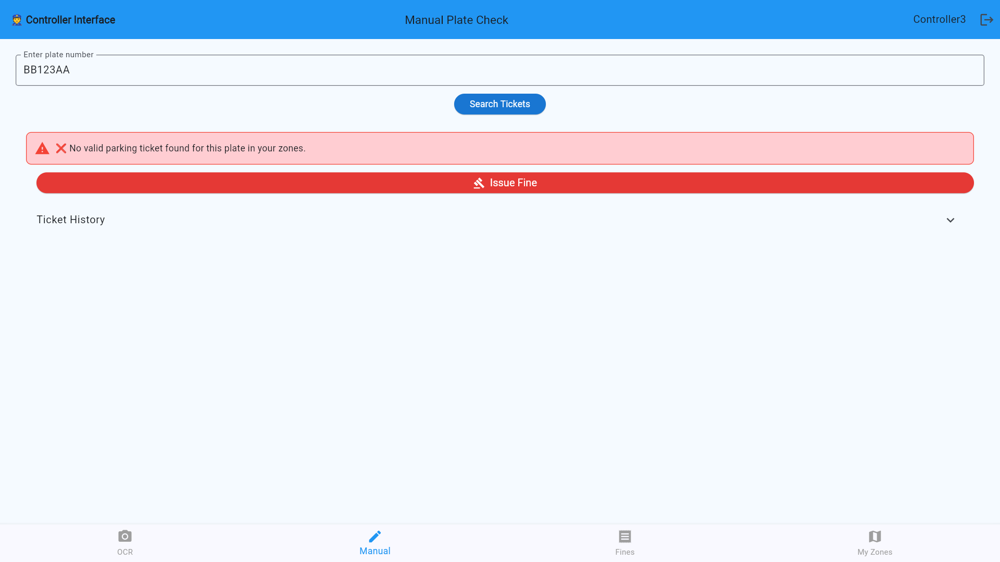
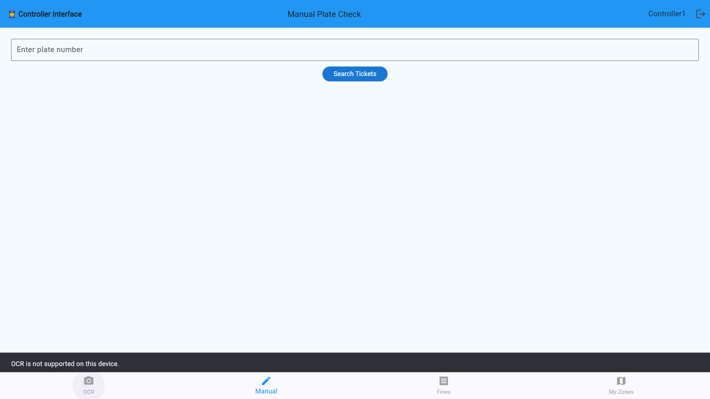
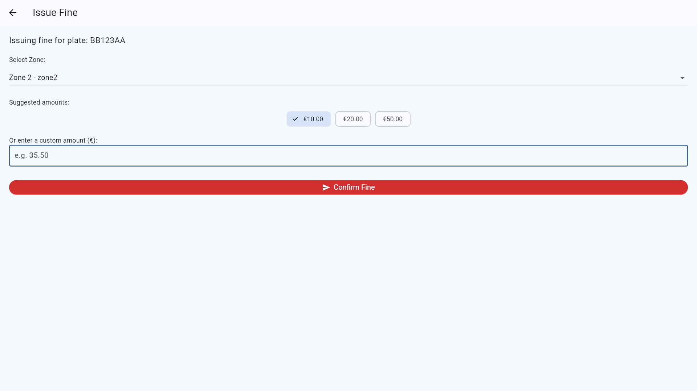
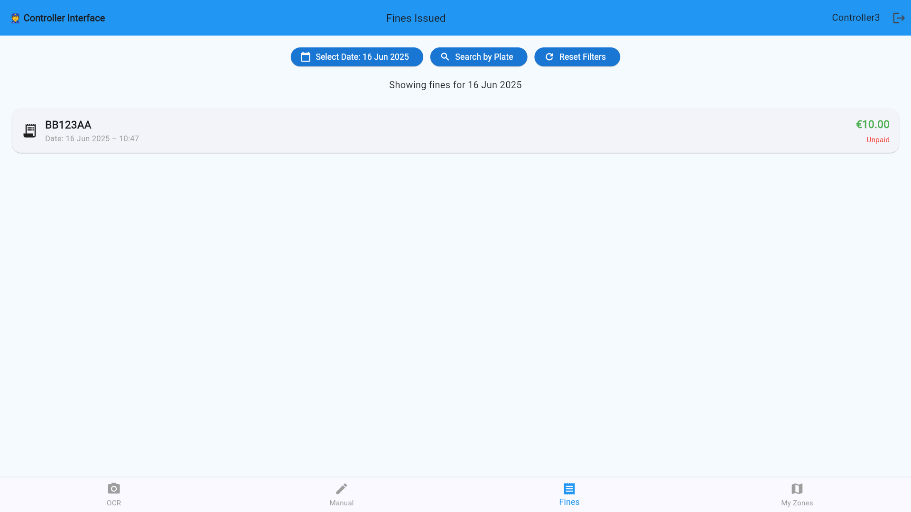
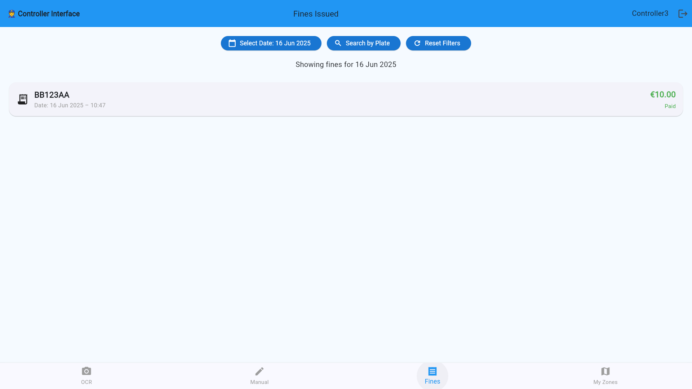
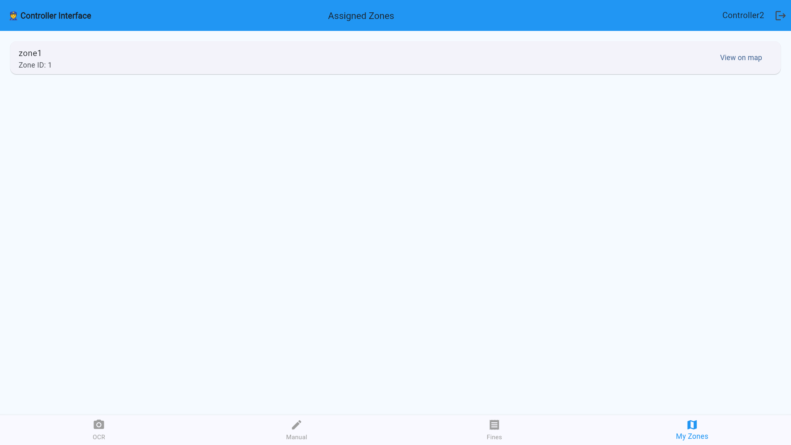

# 🛂 Controller User Guide

The **Controller Dashboard** is built for enforcement personnel to manage parking violations, inspect vehicle sessions, and oversee their assigned zones.

Controllers are essential for maintaining compliance and order in public parking areas.

---

> ⚠️ **Zone Assignment Required**  
> If your account has **not been assigned a zone**, all core features—including license plate lookup, fine issuance, and zone monitoring—will be **disabled**.  
> Please contact an Admin to be assigned a valid zone before continuing.

---

## 🔍 View License Plate Information and Status

Controllers can search and view detailed data about any vehicle:

1. Input or scan a **license plate number**

> OCR only available on mobile phone.

2. Check if the vehicle is parked legally
> If a violation is confirmed, you can issue a **fine** directly:

---

## 🧾 Add a Fine
1. Press the **Issue Fine** button after confirming a violation
2. Set zone and fine amount (or use preset)

3. Press the **Confirm Fine** button to finalize

---

## 💳 View Fine Status

Controllers can monitor the status of previously issued fines:

> Fines statuses will be updated automatically as drivers pay them.
---

## 🗺️ View Assigned Zones

Each controller is assigned to one zone. From  **My Zones**, you can:

- See a map of your **assigned zone**
- View zone name and ID

---

