# 🚘 Driver User Guide

Welcome to the **Driver Dashboard** — your personal hub for managing vehicle, parking, and payment activities in the **Open Park Project** app.

---

## 🆕 Register a Driver Account

New to the platform? Easily create your Driver account directly from the login screen.

### 🛠 How to Register:
1. On the login page, input your username and password, then press the **Sign in/Sign up** button.
   
2. If the account does not exist, you will turn to the registration form.
3. Fill in:
   - Username
   - Password
   - Confirm Password
   - Name
   - Surname
   - Email address
> What you already input will be automatically filled in.
4. Press **Create Account**.
5. 🎉 Your account will be created instantly as a **Driver**
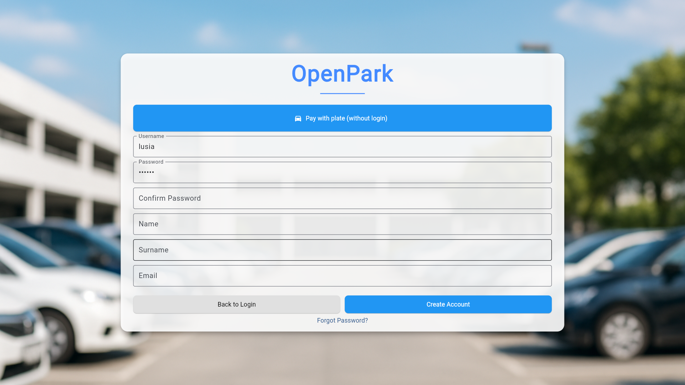
> ✅ Once registered, you can immediately log in.

---

## 🚗 Vehicle License Plate Management

Maintain accurate and updated vehicle info to ensure smooth parking and enforcement checks.

### ✅ Features:
- Add new license plates
- Edit or delete existing plates
- Set a **default plate** for faster ticket purchases
- View plate history and usage logs

📷 _Insert screenshot: license plate management UI_

> 🔒 All vehicle data is securely stored and used only for authorized operations.

---

## 🎟️ Purchase & Extend Parking Tickets

Buy and manage digital parking tickets anytime, anywhere.

### 🛒 Purchase Ticket: For more details about payment methods, see the [Visitor Guide](visitor.md).
#### 💻 Option 1: Digital Payment via App
1. Press the **Pay with plate(without login)** button
   
2. Select the **zone**
   
> You can also select a zone from the map by pressing the **Choose on map** button.
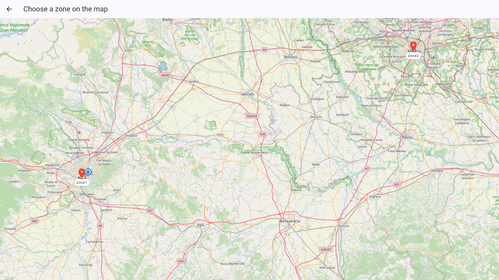
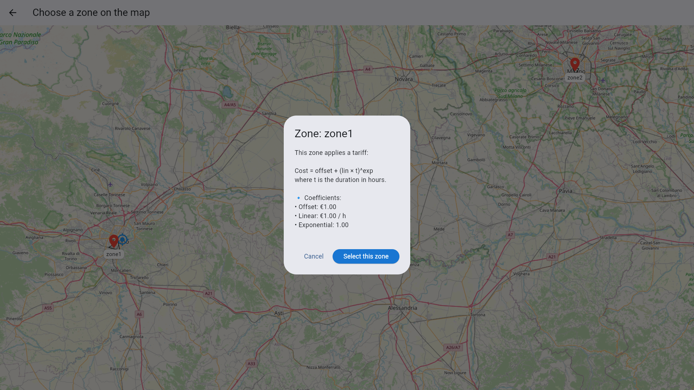
3. Enter your **license plate** or choose an existing one
   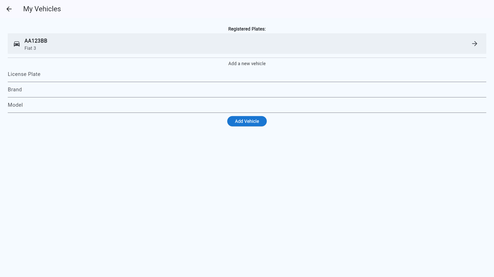
4. Select the **Parking Duration**:
   
   
   
5. Check out and choose a **payment method**:
- 💳 Credit/Debit Card
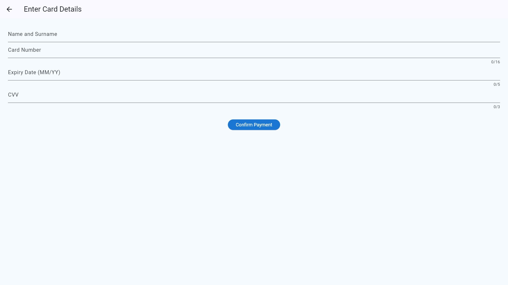
- 📱 Apple Pay / Google Pay / Mobile Wallet
6. Ticket is instantly activated
   

#### 🏧 Option 2: Pay via Totem (Card Tap): Only available for parking zones with Totem installed.
1. Enter your **license plate** or choose an existing one
   
2. Select the **Parking Duration**:
   
   
   
3. Check out and choose **Pay by Card**:
   
4. Tap a **contactless card**
   
> If the totem is installed with no RFID, you can only pay by inputting card information, not by tapping the card,just like the digital payment method choose card payment.
5. Wait for confirmation and ticket issuance
   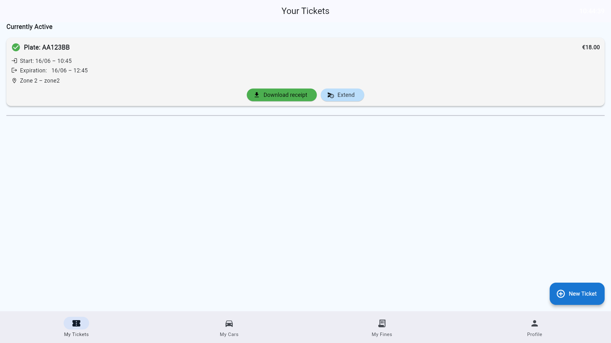
> You can choose to pay now or later, but the ticket must be paid before the parking session starts.
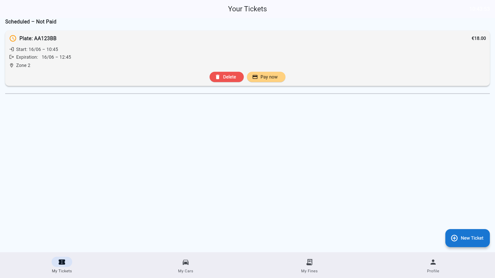
### 🔄 Extend Active Ticket:
1. Press **Extend Ticket** on an active ticket
2. Add more time to your current session
   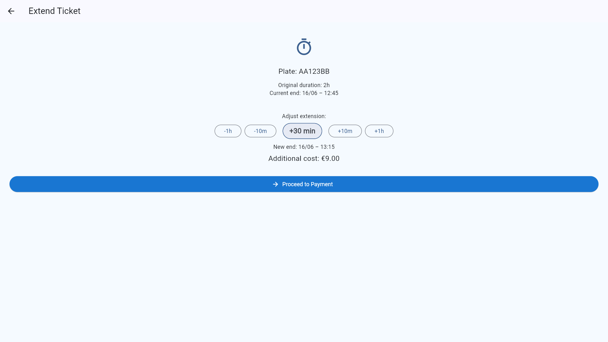
3. Confirm and pay additional amount
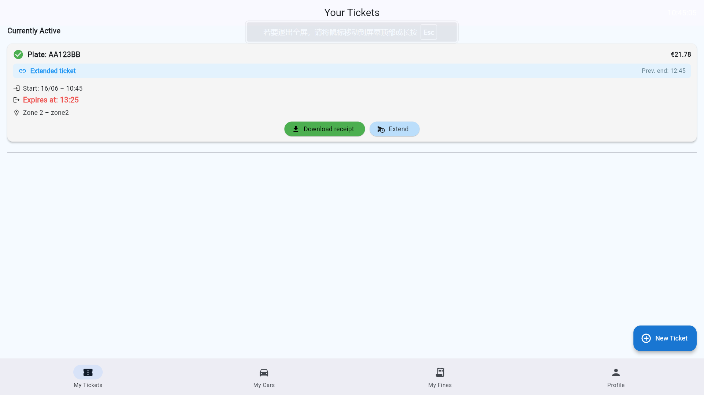
> ⏳ You can extend tickets as long as they are active and not expired.
---

## 💳 View & Pay Fines

Drivers can view fines issued by controllers and pay directly through the app.

### 📋 Fine Details:
- Price of fine
- Date & plate number
- Status: `Unpaid`, `Paid`

### 💰 Pay Fines:
1. Select an unpaid fine and press the **Pay Now** button
   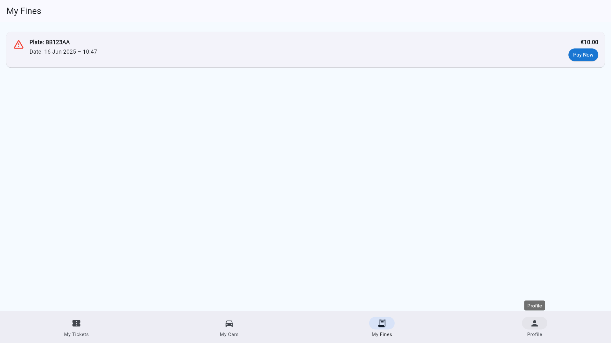
2. Choose payment method
3. View receipt after payment
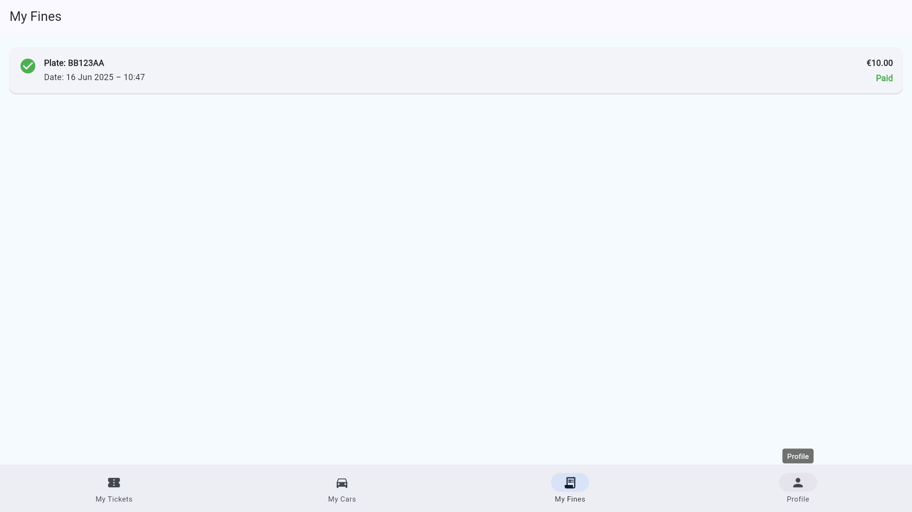

> 💡 Prompt payment prevents added penalties and account restrictions.

---

## 👤 Update Personal Information

Keep your profile current and secure.

### 🛠 How to Update:
1. Press the **Edit Profile** button
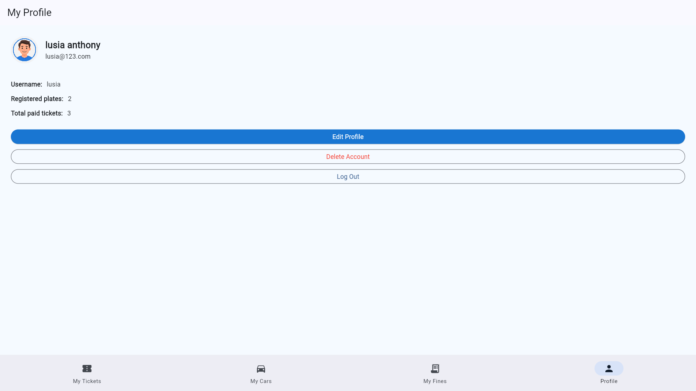
2. Update your information:
   - Name
   - Surname
   - Email
   - Password
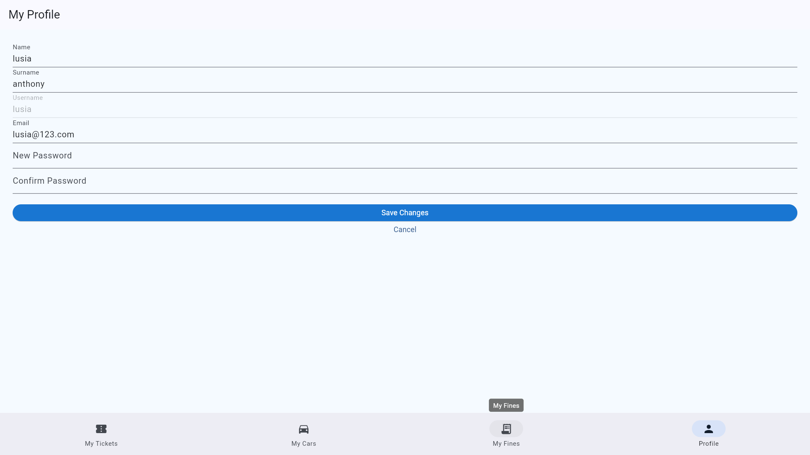
3. Press the **Save Changes** button to apply updates

> 📱 Your account is accessible across devices with a secure login.

> Also, you can delete your account by pressing the **Delete Account** if you no longer need it.

---

## Important Notes:
If the totem is installed with no RFID, you can only pay by inputting card information, not by tapping the card,just like the digital payment method choose card payment.