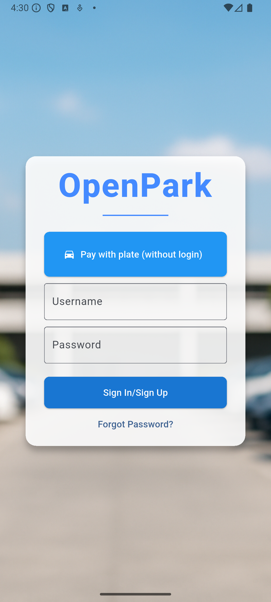

# 🚀 Features

The **Open Park Project** app delivers a comprehensive set of features designed to enhance the parking experience for all user roles — **Drivers**, **Controllers**, and **Administrators**.

---

## 🌐 Cross-Platform Accessibility

- Available on **Android**, **iOS**, and **Web** platforms
- Offers both **mobile** and **web** versions for maximum flexibility
- Enjoy a seamless experience across devices

> ⚠️ **Note:** Some advanced features may be limited or unavailable on the web version.

### 📱 Mobile Interface (Android Example)

---

### 💻 Web Interface (Edge Example)

---

## 🧩 Role-Based Functionality

The application provides tailored interfaces and tools for each role:

- 🚘 **[Drivers](driver.md): [Download Guide](drivers.pdf)**  
  Purchase tickets, manage parking sessions, and pay fines.

- 🛂 **[Controllers](controller.md): [Download Guide](controllers.pdf)** 
  Enforce parking rules, issue fines in assigned zones, and monitor vehicle compliance.

- 🛠️ **[Admins](admin.md) :[Download Guide](admins.pdf)**
  Configure zones, manage user accounts, and set up totems for secure payments.

- 🛡️ **[Superusers](superuser.md): [Download Guide](superusers.pdf)**
  Provide global oversight, manage all user roles, and access system statistics.

- 🏪 **[Visitors](visitor.md): [Download Guide](visitors.pdf)**
  Purchase tickets without registration, only by entering license plates.
---

With its intuitive interface and robust features, the Open Park Project app brings smart parking management to your fingertips.
