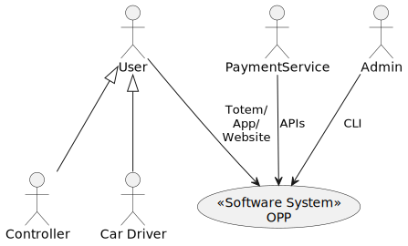
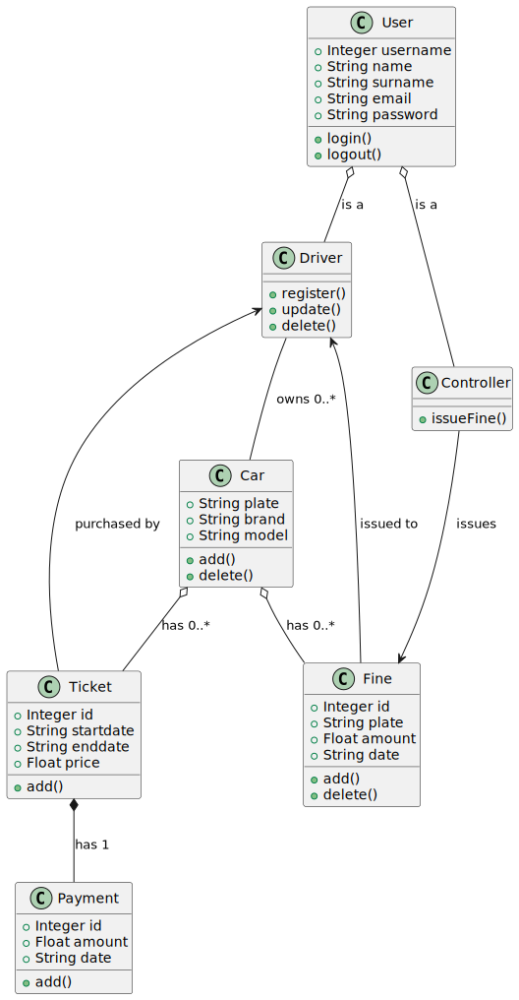

# Requirements Document

## Overview
The OPP (Online Parking Payment) system is designed to facilitate the management of parking spaces, fines, and tickets for both car drivers and controllers. 

The system will provide a user-friendly interface for car drivers to manage their vehicles, pay for parking, and receive notifications about fines and parking expirations. Controllers will have the ability to issue fines, manage parking zones, and monitor parking space occupancy.
The system will also include an admin interface for managing users and parking zones. 

The OPP system will be accessible through a web application, mobile app, and totem kiosks.

Built as a modern, cloud-native application, OPP leverages containerization, microservices architecture, and CI/CD pipelines for rapid deployment and scaling.
The system is designed to be highly available, resilient, and scalable to accommodate varying loads and future growth. The cloud-native infrastructure ensures optimal resource utilization while maintaining performance and security.

## Context diagram

## Requirements

| ID | Description | Priority |
|----|-------------|----------|
| 1  | **User Account Management** | -------- |
| 1.1 | Unauthenticated Users shall be able to register as Car Drivers | High |
| 1.2 | Users shall be able to login | High |
| 1.3 | Users shall be able to logout | High |
| 1.4 | Users shall be able to view their profile | High |
| 1.5 | Users shall be able to edit their profile | High |
| 1.6 | Car Driver Users shall be able to delete their profile | High |
| 2  | **User Administration** | -------- |
| 2.1 | Admin shall be able to view all types of users, including Controllers and Admin | High |
| 2.2 | Admin shall be able to create Car Driver and Controller Users | High |
| 2.3 | Admin shall be able to delete Car Driver and Controller Users | High |
| 3  | **Car Management** | -------- |
| 3.1 | Car Drivers shall be able to view all their cars | High |
| 3.2 | Car Drivers shall be able to add cars to their own profile | High |
| 3.3 | Car Drivers shall be able to delete cars belonging to them | High |
| 3.4 | Controllers shall be able to view all parked cars | High |
| 4  | **Fine Management** | -------- |
| 4.1 | Controllers shall be able to issue fines to parked cars | High |
| 4.2 | Controllers shall be able to view fines | High |
| 4.3 | Controllers shall be able to delete fines | High |
| 4.4 | Car Drivers shall be able to view fines belonging to their cars | High |
| 5  | **Ticket Management** | -------- |
| 5.1 | Car Driver shall be able to view all their tickets | High |
| 5.2 | Car Driver shall be able to buy tickets | High |
| 5.3 | Car Driver shall be able to delete tickets | High |
| 5.4 | Controller shall be able to view all tickets | High |
| 6  | **Payment Processing** | -------- |
| 6.1 | Car Drivers shall be able to pay for a ticket | High |
| 7  | **Notification System** | -------- |
| 7.1 | System shall notify Car Drivers before parking expires | Medium |
| 7.2 | System shall notify Car Drivers when fines are issued | High |
| 7.3 | Controllers shall receive alerts about expired parking | High |

Nice to have:

| ID | Description | Priority |
|----|-------------|----------|
| 8  | **Parking Space Management** | -------- |
| 8.1 | Admin shall be able to add parking zones | High |
| 8.2 | Admin shall be able to define parking rules per zone | High |
| 8.3 | Admin shall be able to set pricing rates per zone | High |
| 8.4 | Controllers shall be able to view parking zone information | Medium |
| 8.5 | Car Drivers shall be able to see available parking spaces | High |
| 8.6 | Car Drivers shall be able to see parking zone rules | Medium |
| 8.7 | System shall track parking space occupancy | High |
| 9  | **Navigation & Map Features** | -------- |
| 9.1 | **Car Driver Map Features** | -------- |
| 9.1.1 | Car Drivers shall be able to view parking zones on a map | Low |
| 9.1.2 | Car Drivers shall be able to view parking space availability on a map | Low |
| 9.1.3 | Car Drivers shall be able set parking position on a map | Low |
| 9.2 | **Controller Map Features** | -------- |
| 9.2.1 | Controllers shall be able to view a map of the parking lot with all parked cars | Low |
| 9.2.2 | Controllers shall be able to select cars on the map to issue fines | Low |
| 9.3 | **System Integration** | -------- |
| 9.3.1 | System shall support integration with third-party navigation apps | Low |
| 9.4 | **License Plate Recognition** | -------- |
| 9.4.1 | Controllers shall be able to issue fines by taking a photo of a license plate | Low |

## Class Diagram

## Architecture

