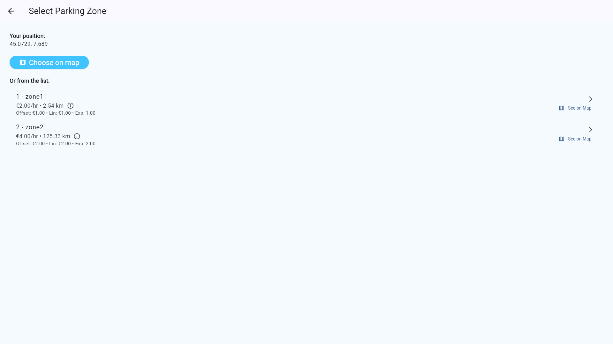
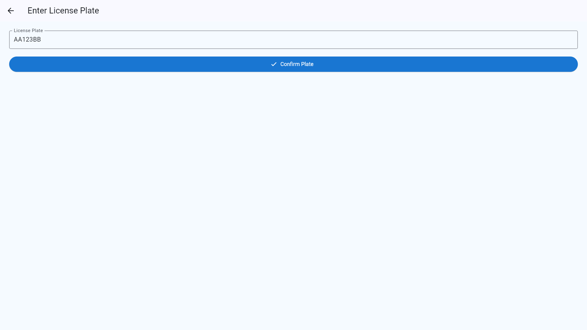
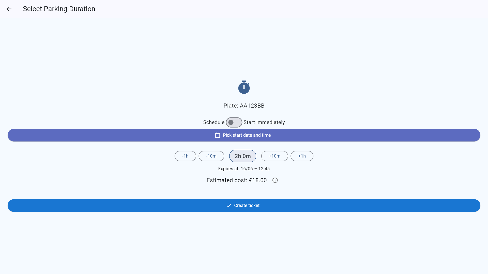
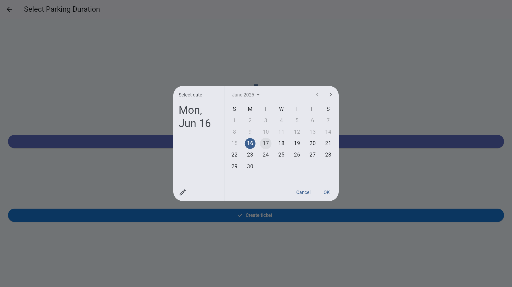
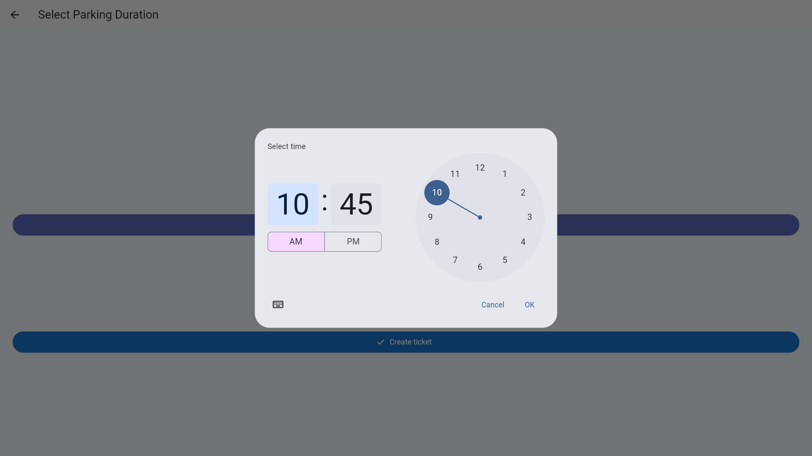
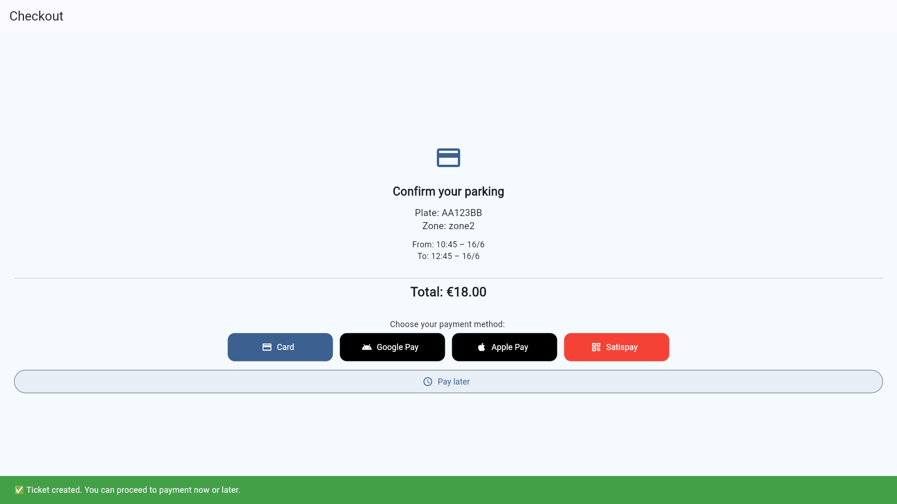
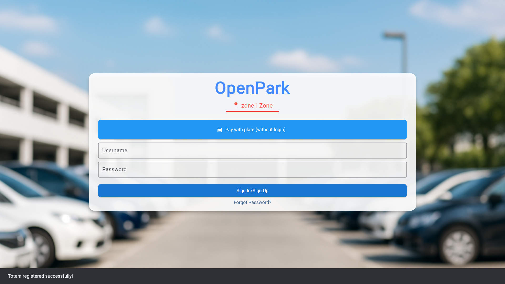
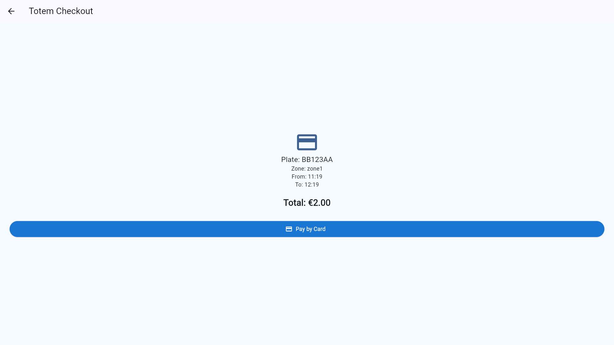
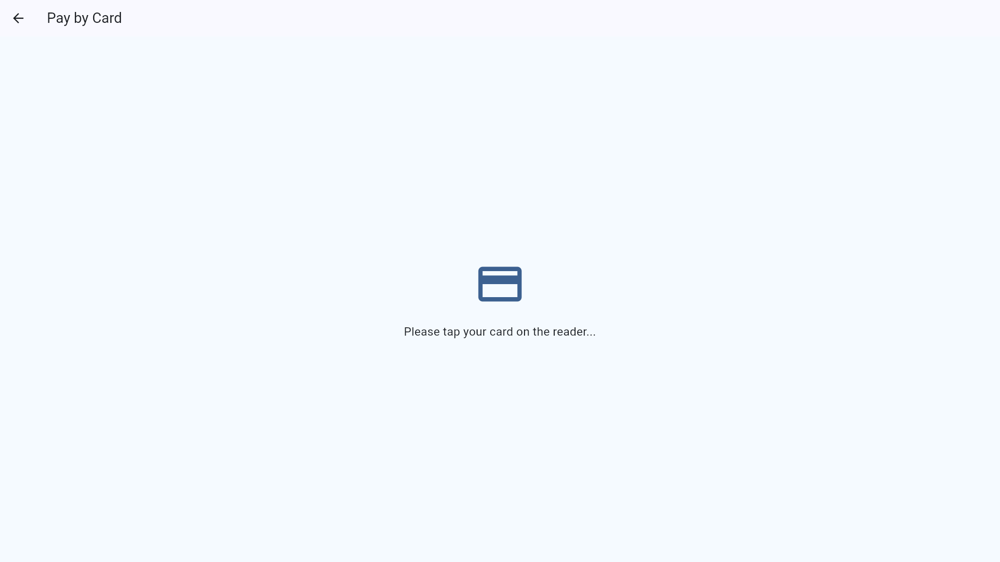

# 🏪 Visitor Guide
For users and visitors, the OpenPark offers two convenient ways to purchase parking tickets:
One via the mobile app, and the other through a physical Totem machine.
For registered users, you can check other guides for more details.
In this guide, we will focus on the payment methods available for visitors and non-registered users.
---

## 💻 Option 1: Digital Payment via App

Users can purchase parking tickets using digital methods from their smartphone.

### 🛠 Payment Process:
1. Press **Pay with plate(without login)**

2. Select the **zone**

3. Enter your **license plate**

4. Select the **Parking Duration**:

5. Check out and choose a **payment method**:
  - 💳 Credit/Debit Card
  - 📱 Apple Pay / Google Pay / Mobile Wallet
6. Ticket is instantly activated

### ✅ Best For:
- Frequent drivers
- Users who want ticket history, extension, and receipts
- Those who prefer app-based management
---

## 🏧 Option 2: Pay via Totem (Card Tap)
The **Totem** is a self-service, automated parking ticket vending machine designed to offer users a fast, intuitive, and app-free ticketing experience in designated parking zones.
Totems are especially helpful for visitors and non-registered users who prefer not to use mobile apps for parking.

The Totem provides a **contactless, account-free** alternative for purchasing tickets.

### 🛠 Payment Process:
1. Approach the Totem
2. Press **Pay with plate(without login)**

3. Enter your **license plate**

4. Select the **Parking Duration**:

5. Check out and choose **Pay by Card**:

6. Tap a **contactless card**

7. Wait for confirmation and ticket issuance

### ✅ Best For:
- People without the app
- Quick, one-time ticket purchases
- Those who prefer physical payment methods
> Totems are only available in specific parking zones where they are installed and only use for buying tickets, not for paying fines.
---

## 🔄 Payment Method Comparison

| Aspect              | 💻 Digital Payment (App)            | 🏧 Totem Payment (Card Tap)     |
|---------------------|-------------------------------------|---------------------------------|
| **Process**         | In-app or QR code → plate → pay     | Use Totem → plate → tap card    |
| **Ease of Use**     | Requires smartphone and internet    | Requires physical presence only |
| **Payment Methods** | Credit/Debit, Apple Pay, Google Pay | Contactless card only           |
> 🎯 Both options generate a valid parking session and sync with the enforcement system.

---

